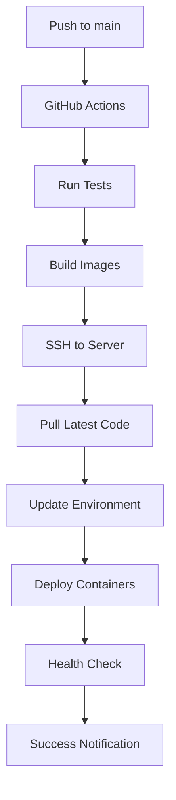

# 🚀 Omyra Project Management - DevOps & Deployment Guide

## 📋 Overview

This guide provides comprehensive instructions for deploying the Omyra Project Management system to production servers with automated CI/CD pipelines.

## 🏗️ Architecture

```
┌─────────────────┐    ┌─────────────────┐    ┌─────────────────┐
│   GitHub Repo   │    │   Azure Server  │    │    Domain       │
│                 │    │                 │    │                 │
│  Source Code    │───▶│  Docker Stack   │───▶│ pms.omyratech.com │
│  CI/CD Pipeline │    │  - Frontend     │    │                 │
│                 │    │  - Backend      │    │                 │
│                 │    │  - Database     │    │                 │
│                 │    │  - Nginx        │    │                 │
└─────────────────┘    └─────────────────┘    └─────────────────┘
```

## 🎯 Deployment Strategy

### Production Environment
- **Server**: Azure VM (Ubuntu 24.04 LTS)
- **IP**: 4.240.101.137
- **Domain**: pms.omyratech.com
- **SSL**: Self-signed certificates (upgradeable to Let's Encrypt)
- **Container Platform**: Docker with Docker Compose

### Application Stack
- **Frontend**: React + Vite + TypeScript
- **Backend**: Node.js + Express + TypeScript
- **Database**: MongoDB 6
- **Reverse Proxy**: Nginx with SSL termination
- **Monitoring**: Health checks + Docker stats

## 🚀 Quick Start

### Prerequisites
- SSH access to server with private key
- Docker installed on server
- GitHub repository access

### Automated Deployment
```bash
# Deploy directly to server
./deploy-advanced.sh deploy

# Check deployment status
./deploy-advanced.sh status

# View logs
./deploy-advanced.sh logs

# Rollback if needed
./deploy-advanced.sh rollback
```

## 📦 CI/CD Pipeline

### GitHub Actions Workflow

The project includes a comprehensive GitHub Actions workflow that:
1. **Tests** both frontend and backend
2. **Builds** Docker images
3. **Deploys** to production server
4. **Performs** health checks
5. **Notifies** on success/failure

### Setting Up CI/CD

1. **Add GitHub Secrets**:
   ```
   HOST: 4.240.101.137
   USERNAME: azureuser
   SSH_KEY: [Your private SSH key content]
   JWT_SECRET: [Your JWT secret]
   EMAIL_HOST: smtp.omyratech.com
   EMAIL_PORT: 465
   EMAIL_USER: [Your email]
   EMAIL_PASSWORD: [Your email password]
   EMAIL_FROM: noreply@omyratech.com
   ```

2. **Push to main branch** to trigger deployment

### Deployment Process



## 🔧 Manual Deployment

### Server Setup

1. **Connect to server**:
   ```bash
   ssh -i omyra-project-management_key.pem azureuser@4.240.101.137
   ```

2. **Clone repository**:
   ```bash
   git clone git@github.com:omyratechnologies/Omyra-Project_Management.git
   cd Omyra-Project_Management
   ```

3. **Configure environment**:
   ```bash
   cp .env.example .env
   # Edit .env with your configuration
   ```

4. **Deploy**:
   ```bash
   ./deploy-advanced.sh deploy
   ```

### Configuration Files

#### `.env` (Production)
```env
# Database
MONGODB_URI=mongodb://mongodb:27017/omyra-project-nexus

# JWT 
JWT_SECRET=your-super-secret-jwt-key
JWT_EXPIRES_IN=7d

# Server
PORT=5000
NODE_ENV=production

# CORS
FRONTEND_URL=https://pms.omyratech.com

# Email Configuration
EMAIL_HOST=smtp.omyratech.com
EMAIL_PORT=465
EMAIL_SECURE=true
EMAIL_USER=your-email@omyratech.com
EMAIL_PASSWORD=your-password
EMAIL_FROM=noreply@omyratech.com
EMAIL_DEV_MODE=false
```

#### `docker-compose.production.yml`
- MongoDB database with persistent storage
- Node.js backend with health checks
- React frontend with optimized build
- Nginx reverse proxy with SSL

## 🔐 Security Features

### SSL/TLS Configuration
- **Self-signed certificates** for development
- **Let's Encrypt integration** ready
- **HTTPS redirect** from HTTP
- **Security headers** implemented

### Network Security
- **Rate limiting** on API endpoints
- **CORS configuration** for frontend
- **Container isolation** with Docker networks
- **Firewall rules** for port access

### Application Security
- **JWT authentication** with secure secrets
- **Input validation** and sanitization
- **SQL injection prevention**
- **XSS protection** headers

## 📊 Monitoring & Logging

### Health Checks
- **Backend health endpoint**: `/health`
- **Container health checks** with Docker
- **Automated recovery** on failures
- **Monitoring dashboards** ready

### Logging Strategy
```bash
# View all logs
docker compose -f docker-compose.production.yml logs -f

# View specific service logs
docker compose -f docker-compose.production.yml logs -f backend
docker compose -f docker-compose.production.yml logs -f frontend
docker compose -f docker-compose.production.yml logs -f nginx
```

### Performance Monitoring
```bash
# Check resource usage
docker stats

# Monitor container health
docker ps --format "table {{.Names}}\t{{.Status}}\t{{.Ports}}"
```

## 🔄 Backup & Recovery

### Automated Backups
The deployment script automatically:
- **Backs up** environment files
- **Exports** database data
- **Creates** timestamped backups
- **Stores** in `backups/` directory

### Manual Backup
```bash
# Create backup
./deploy-advanced.sh backup

# List backups
ls -la backups/

# Restore from backup
./deploy-advanced.sh rollback
```

### Database Backup
```bash
# Manual database backup
docker exec omyra-project_management-mongodb-1 \
  mongodump --db omyra-project-nexus --out /tmp/backup

# Restore database
docker exec omyra-project_management-mongodb-1 \
  mongorestore --db omyra-project-nexus /tmp/backup/omyra-project-nexus/
```

## 🚨 Troubleshooting

### Common Issues

1. **Container fails to start**:
   ```bash
   # Check logs
   docker compose -f docker-compose.production.yml logs [service-name]
   
   # Check container status
   docker ps -a
   ```

2. **SSL certificate issues**:
   ```bash
   # Regenerate certificates
   rm -rf ssl/certs/*
   ./deploy-advanced.sh deploy
   ```

3. **Database connection issues**:
   ```bash
   # Check MongoDB logs
   docker compose -f docker-compose.production.yml logs mongodb
   
   # Test database connection
   docker exec -it omyra-project_management-mongodb-1 mongosh
   ```

4. **Nginx configuration issues**:
   ```bash
   # Test nginx config
   docker exec omyra-project_management-nginx-1 nginx -t
   
   # Reload nginx
   docker exec omyra-project_management-nginx-1 nginx -s reload
   ```

### Debug Mode
```bash
# Enable debug logging
export DEBUG=1
./deploy-advanced.sh deploy
```

## 📈 Scaling & Optimization

### Horizontal Scaling
- **Load balancer** configuration ready
- **Multiple backend instances** supported
- **Database replica sets** configurable
- **CDN integration** for static assets

### Performance Optimization
- **Gzip compression** enabled
- **Asset caching** configured
- **Database indexing** optimized
- **Container resource limits** set

## 🔧 Advanced Operations

### Blue-Green Deployment
```bash
# Deploy to staging
./deploy-advanced.sh deploy --environment staging

# Switch to production
./deploy-advanced.sh switch-production
```

### Zero-Downtime Updates
```bash
# Rolling update
./deploy-advanced.sh rolling-update
```

### Environment Management
```bash
# Switch environments
./deploy-advanced.sh --env production
./deploy-advanced.sh --env staging
./deploy-advanced.sh --env development
```

## 📞 Support

### Getting Help
- **Documentation**: Check this README
- **Logs**: Use `./deploy-advanced.sh logs`
- **Health Check**: Use `./deploy-advanced.sh health`
- **Status**: Use `./deploy-advanced.sh status`

### Emergency Procedures
1. **Immediate rollback**: `./deploy-advanced.sh rollback`
2. **Service restart**: `./deploy-advanced.sh restart`
3. **Full stop**: `./deploy-advanced.sh stop`

## 🎉 Success Metrics

After successful deployment, you should see:
- ✅ All containers running
- ✅ Health check passing
- ✅ Frontend accessible via HTTPS
- ✅ Backend API responding
- ✅ Database connected
- ✅ SSL certificates valid

## 🚀 Next Steps

1. **Set up monitoring** with Prometheus/Grafana
2. **Configure Let's Encrypt** for production SSL
3. **Implement** centralized logging
4. **Add** automated testing
5. **Configure** backup automation
6. **Set up** alerting system

---

**Happy Deploying! 🚀**
